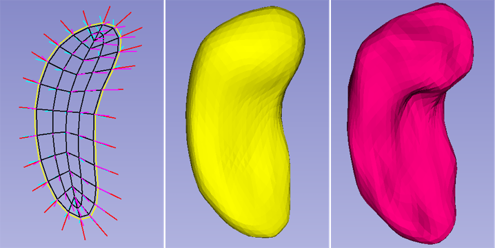
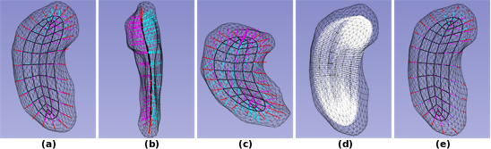

# Skeletal Representation Extension
## Description
Skeletal representation has been proved a robust model for shape analysis. This toolkit provides utilities to initialize, refine and visualize skeletal representation model of an object.
It has been incorporated as an extension in [SlicerSALT](http://salt.slicer.org/). More detailed tutorial is under construction.
## Features
This extension has 3 major features at the moment:
1. Fit a skeletal representation to an object. The following screeshots are (Left) an initial s-rep fitted to (Right) a hippocampus. The middle figure is the implied boundary of the initial fit. 
The cyan, magenta and red line segments in the left figure are called ``spokes''. The yellow curve is the fold curve. The sampling rate of the initial s-rep can be controlled by 

2. Refinement. This stage aims to optimize the geometric and topological properties of fitted s-reps. The optimization involves multi-level objectives: 1) image match 2) normal match and 3) geometric regularity.
The following figures show (a-c) the initial fit of an hippocampus, (d) the interpolated initial fit and (e) the refined s-rep.

3. Visualize the skeletal representationP

## Tutorial

